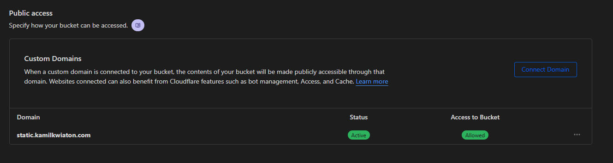
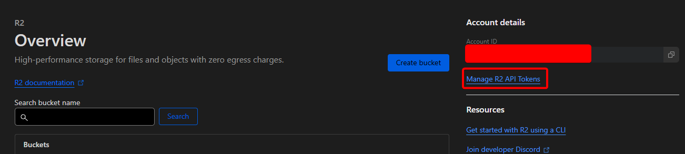

This is fork of Rufus Pollock S3 Bucket Listing https://github.com/rufuspollock/s3-bucket-listing updated to work with R2 storage on CloudFlare. As I was learning JS doing these changes expect things to break :)

Create nice directory listings for R2 buckets using only javascript and HTML.

The listing can be deployed on any site and can also be deployed into a bucket.

Inspiration from http://aws.amazon.com/code/Amazon-S3/1713

## Example

Example usage could be found here: https://static.kamilkwiaton.com/

## Usage

Copy these 4 lines into the HTML file where you want the listing to show up:

    <div id="navigation"></div>
    <div id="listing"></div>

    <!-- add jQuery - if you already have it just ignore this line -->
    <script type="text/javascript" src="https://ajax.googleapis.com/ajax/libs/jquery/3.1.1/jquery.min.js"></script>

    <!-- the JS variables for the listing -->
    <script type="text/javascript">
        // var S3BL_IGNORE_PATH = true;
        // var BUCKET_NAME = 'CLOUDFLARE BUCKET';
        // var R2_ENDPOINT = 'https://S3_API_URL.r2.cloudflarestorage.com';
        // var BUCKET_WEBSITE_URL = 'BUCKET CUSTOM DOMAIN';
        // var READ_ONLY_ACCESS_KEY = ''; !!PLEASE TYPE READ ONLY ACCESS KEY!!
        // var READ_ONLY_SECRET_KEY = ''; !!PLEASE TYPE READ ONLY ACCESS KEY!!
        // var S3B_ROOT_DIR = 'SUBDIR_L1/SUBDIR_L2/';
        // var S3B_SORT = 'DEFAULT';
        // var EXCLUDE_FILE = ["index.html","list.js"];  // change to array to exclude multiple files, regexp also supported e.g. /^(.*\/)?index.html$/ to exclude all index.html
        // var AUTO_TITLE = true;
    </script>

    <!-- the JS to the do the listing -->
    <script type="text/javascript" src="https://github.com/Kapsztajn/r2-bucket-listing/list.js"></script>

We've provided an example [index.html][index] file you can just copy if you want.

[index]: https://github.com/Kapsztajn/r2-bucket-listing/blob/r2/test/index.html


## How it works

The script downloads your XML bucket listing, parses it and simulates a webserver's text-based directory browsing mode.


### `S3BL_IGNORE_PATH` variable

Valid options = `false` (default) or `true`

Setting this to false will cause URL navigation to be in this form:
- _`http://data.openspending.org/worldbank/cameroon/`_

You will have to put the html code in your page html AND your error 404 document.

Setting this to true will cause URL navigation to be in this form:
- _`http://data.openspending.org/index.html?prefix=worldbank/cameroon/`_

### `BUCKET_NAME` variable

This variable is required.

Type your Bucket name from CloudFlare R2. Only name is needed.

### `R2_ENDPOINT` variable

This variable is required.

Type your S3 API URL which you can find in CloudFlare settings.

### `S3B_ROOT_DIR` variable

Valid options = `''` (default) or `'SUBDIR_L1/'` or `'SUBDIR_L1/SUBDIR_L2/'` or etc.

- Do __NOT__ put a leading '/',     e.g. `'/SUBDIR_L1/'`
- Do __NOT__ omit the trailing '/', e.g. `'SUBDIR_L1'`

This will disallow navigation shallower than your set directory.

Note that this only disallows navigation to shallower directories, but __NOT__ access. Any person with knowledge of the existence of bucket XML listings will be able to manually access those files.


### `BUCKET_WEBSITE_URL` variable

This variable is required. You need to configure Custom Domain on CloudFlare.

### `READ_ONLY_ACCESS_KEY` variable

This variable is required. You need to create Read only Access Key for your CloudFlare R2 bucket and provide it directly in HTML file.

### `READ_ONLY_SECRET_KEY` variable

This variable is required. You need to create Read only Secret Key for your CloudFlare R2 bucket and provide it directly in HTML file.

### `S3B_SORT` variable

This will sort your bucket listing. Variable options should be self-explanatory.

Valid options:

- `OLD2NEW`
- `NEW2OLD`
- `A2Z`
- `Z2A`
- `BIG2SMALL`
- `SMALL2BIG`


### `EXCLUDE_FILE` variable

This variable is optional.  It allows you to exclude a file (e.g. index.html) or a list of files from the file listings.


### `AUTO_TITLE` variable

This variable is optional.  It allows you to automatically set the title.


## Valid Configurations

1. Use CloudFlare R2 in website mode with custom domain


#### 1. Embed into your website

Mandatory settings:

```
      var S3BL_IGNORE_PATH = true;
      var BUCKET_NAME = 'kamilkwiaton';
      var R2_ENDPOINT = 'https://ba8cf10a812d56d3e44525c16b0fe9fd.r2.cloudflarestorage.com';
      var BUCKET_WEBSITE_URL = 'https://static.kamilkwiaton.com';
      var READ_ONLY_ACCESS_KEY = '72cc5646f386d06b49fd96021c2da04b';
      var READ_ONLY_SECRET_KEY = 'c7a4f3e0c76cbc5e1683385f9bd76224f570b6660e711682cf9da6895f9c5884';
```

Copy the code into whatever file you want to act as your listing page.

## R2 bucket permissions

You must setup the R2 bucket to allow public read access, and create Read credentials

* Setups custom domain
 

* Assign the following CORS policy

```
[
  {
    "AllowedOrigins": [
      "*"
    ],
    "AllowedMethods": [
      "GET"
    ]
  }
]
```

* Create read only API keys
 


## Copyright and License

Copyright 2012-2016 Rufus Pollock.
Copyright 2024-2024 Kamil Kwiaton.

Licensed under the MIT license:

Permission is hereby granted, free of charge, to any person obtaining a copy
of this software and associated documentation files (the "Software"), to deal
in the Software without restriction, including without limitation the rights
to use, copy, modify, merge, publish, distribute, sublicense, and/or sell
copies of the Software, and to permit persons to whom the Software is
furnished to do so, subject to the following conditions:

The above copyright notice and this permission notice shall be included in
all copies or substantial portions of the Software.

THE SOFTWARE IS PROVIDED "AS IS", WITHOUT WARRANTY OF ANY KIND, EXPRESS OR
IMPLIED, INCLUDING BUT NOT LIMITED TO THE WARRANTIES OF MERCHANTABILITY,
FITNESS FOR A PARTICULAR PURPOSE AND NONINFRINGEMENT. IN NO EVENT SHALL THE
AUTHORS OR COPYRIGHT HOLDERS BE LIABLE FOR ANY CLAIM, DAMAGES OR OTHER
LIABILITY, WHETHER IN AN ACTION OF CONTRACT, TORT OR OTHERWISE, ARISING FROM,
OUT OF OR IN CONNECTION WITH THE SOFTWARE OR THE USE OR OTHER DEALINGS IN
THE SOFTWARE.

